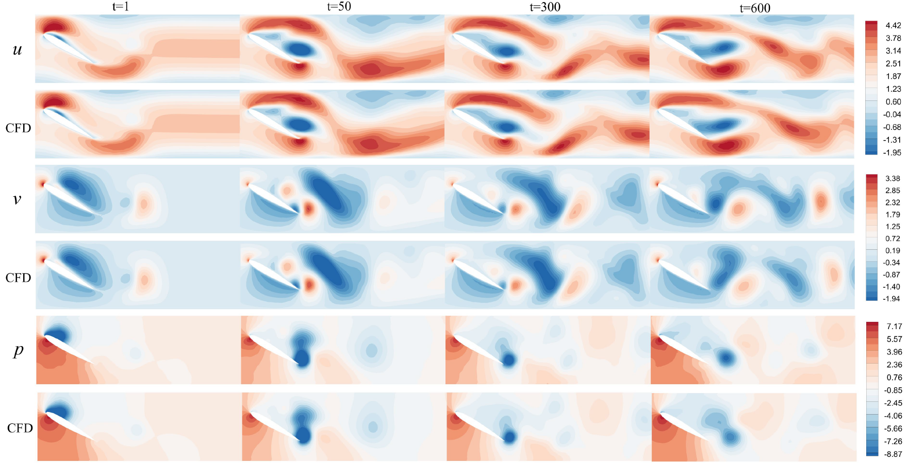

# FVGN
Predicting unsteady incompressible fluid dynamics with finite volume informed neural network


Hi，This repository provides an implementation of graph neural networks based on the finite volume method, and it can be used for incompressible fluid simulation. We provide the detailed implementation process of the model and supply .py files for converting TFrecord dataset files and COMSOL simulation result files into a unified H5 dataset. The final prediction results of our model are visualized using Tecplot.
MeshGraphNets code is modified from https://github.com/google-deepmind/deepmind-research/tree/master/meshgraphnets, which mad meshgraphnet can predict pressure field. We also add single edge encode method support.

# Download dataset
## CYLINDEFRFLOW datset
Datasets can be downloaded using the script download_dataset.sh. It contains a metadata file describing the available fields and their shape, and tfrecord datasets for training, validation and test splits. Dataset names match the naming in the paper. This repo is only suit for incompressible dataset.

## HYBRIDFLOW dataset
Datasets can be download from URL:(coming soon), and run COMSOL with instructions inside the zip files.

# Convert dataset
## TFrecord
Set TF recorddataset path at FVGN-src/main/Extract_mesh/parse_tfrecord_refactor.py and run this .py file. It will convert TFrecord file to H5 file which support map-style dataset in Pytorch.
## HYBRIDFLOW
Set .mphtxt and data file path in FVGN-src/main/Extract_mesh/parse_comsol.py, and run this .py file. It will convert COMSOL results to H5 file.


# Env
We have directly provided a conda environment package that supports both FVGN and MGN simultaneously（download:https://mega.nz/folder/tHJiXDhR#Zy8u7h6dOBgj3DdbM_0o9g）. All you need to do is download and unzip it to the "/path/miniconda3/envs/" directory (note that the new folder's name must be meshgn-pt-tf). Then, run the command
~~~sh
conda env list
~~~
 to check if the environment has been successfully imported.

## FVGN 
Here, we tested that versions above PyTorch 2.0 can successfully run the code in this repository. However, to achieve the fastest training efficiency, our tests have shown that PyTorch version 1.9 offers the quickest training speed. We strongly recommend using two GPUs to run the code in this repository. One GPU should be used for training, while the other GPU is used for real-time testing of the model state performance saved after each epoch. This approach allows obtaining the best model training results at the fastest speed.

## MGN
For users with RTX 30\40\A100 series graphics cards, it would be advisable to install a specific version of TensorFlow via pip to run the MGN code in this repository successfully. This can be done as shown below:
### 1.install tensorflow1.1x wheel index
~~~py
pip install nvidia-pyindex
~~~

### 2.install tensorflow1.1x-gpu version
~~~py
pip install nvidia-tensorflow
~~~
### 3.install other module specified in requirements.txt
For users with other types of graphics cards, you are able to use the environment specified in the original Meshgraphnets repository.

# MGN Train&Test
MGN by default uses bidirectional edges (undirected graph encoding method), while FVGN by default uses unidirectional edges (directed graph encoding method).
you can modify such hyperparameters in all .sh files:
~~~py
batch_size=2
num_training_steps=10000000
num_rollouts=100
dual_edge=true # dual_edge=true means the model will encode undirected graph and causing high demand of memory.
save_tec=false
plot_boundary=true
~~~
Then set your dataset path in the sh file and run .sh file.

~~~sh
sh MGN-src/main/run_model.py 2>&1 | tee training_log.txt
~~~

# FVGN Train&Test
~~~py
batch_size=16
lr=0.001
loss_cont=1
loss_mom=10
dataset_type="h5"
dataset_dir_h5="/path/h5"
loss="direct_mean_loss"
nn_act="SiLU"
Noise_injection_factor=0.02
~~~
~~~sh
sh /home/doomduke2/FVGN-sub-Meshgraphnet/FVGN-src/main/run_train.sh 
~~~
You can find more params instruction in FVGN-src/main/utils/get_param.py

# Project Instruction

```
├── FVGN-src
│   └── main
│       ├── Extract_mesh
│       │   ├── __init__.py
│       │   ├── __pycache__
│       │   ├── parse_comsol.py # Convert comsol simulation results to H5 file
│       │   └── parse_tfrecord_refactor.py # Convert tfrecord results to H5 file
│       ├── FVGN_model
│       │   ├── EncoderProcesserDecoder.py # Main archtecure Finte Volume related computation here
│       │   ├── FVGN.py # FVGN forward process
│       │   ├── GN_blocks.py # Twice-Message aggragation here
│       │   ├── __init__.py
│       │   └── __pycache__
│       ├── dataset
│       │   ├── Load_mesh.py 
│       │   ├── __init__.py
│       │   └── __pycache__
│       ├── requirements.txt
│       ├── rollout.py
│       ├── run_slurm.sh
│       ├── run_train.sh
│       ├── train.py
│       ├── utils
│       │   ├── Logger.py
│       │   ├── __init__.py
│       │   ├── __pycache__
│       │   ├── get_param.py 
│       │   ├── loss_compute.py
│       │   ├── noise.py
│       │   ├── normalization.py
│       │   ├── scheduler.py
│       │   ├── utilities.py
│       │   └── write_tec.py
│       └── validate.py

├── MGN-src
│   └── main
│       ├── meshgraphnets
│       │   ├── cfd_eval.py
│       │   ├── cfd_model.py
│       │   ├── cloth_eval.py
│       │   ├── cloth_model.py
│       │   ├── common.py
│       │   ├── core_model.py
│       │   ├── dataset.py
│       │   ├── download_dataset.sh
│       │   ├── normalization.py
│       │   ├── parse_tfrecord_refactor.py
│       │   ├── plot_cfd.py
│       │   └── plot_cloth.py
│       ├── requirements.txt
│       ├── run_model.py
│       ├── run_test.sh
│       ├── run_train.sh
│       └── run_train_slurm.sh
├── README.md
```


# License
Feel free to clone this repository and modify it! If it's of good use for you, give it a star and please cite our publications!

# References
The organization of the repository's code is inspired by "https://github.com/echowve/meshGraphNets_pytorch".

Params seting method is insipred by "https://github.com/vc-bonn/Unsupervised_Deep_Learning_of_Incompressible_Fluid_Dynamics".

# Contact

Email: lty1040808318@163.com if you have any questions.

By Tianyu Li

